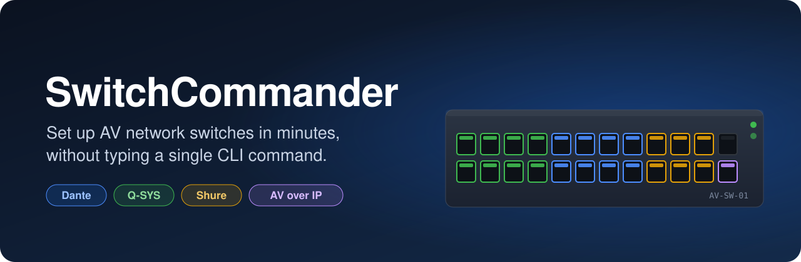
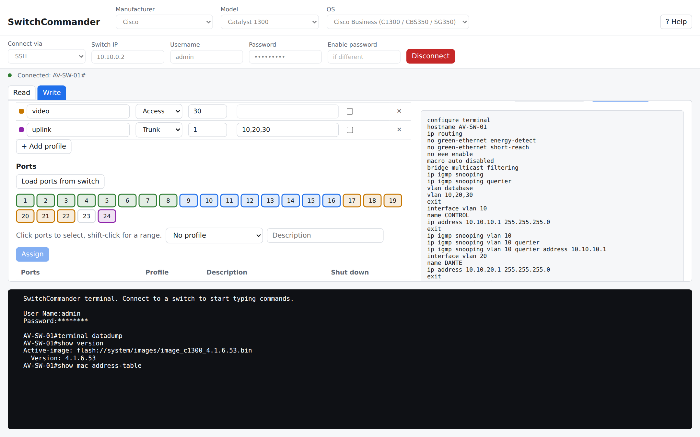
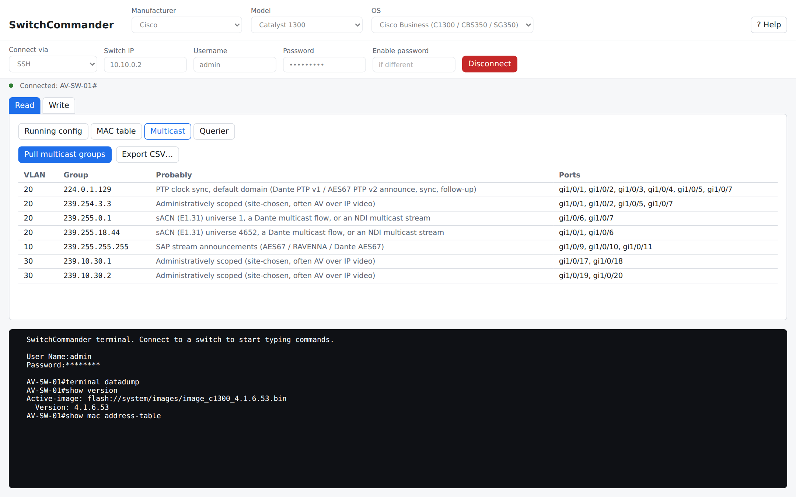
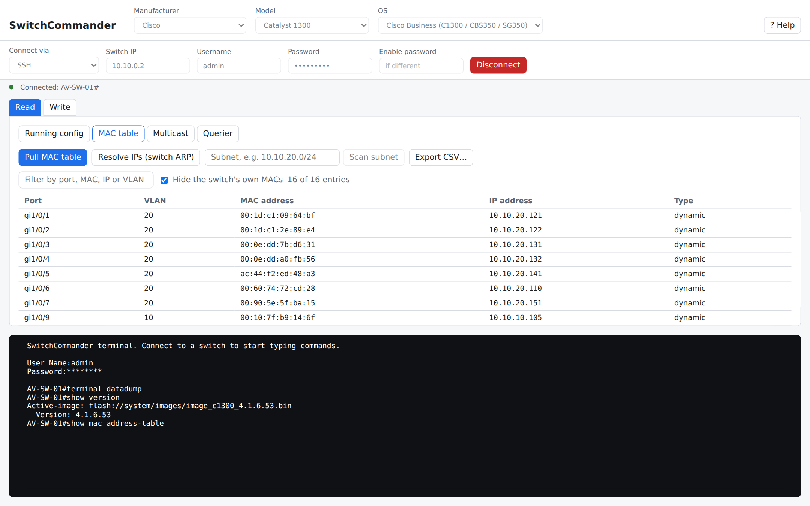

<p align="center">
  
</p>

<p align="center">
  <a href="https://github.com/Krono5/SwitchCommander-releases/releases/latest"></a>
  
</p>

<p align="center">
  <a href="https://github.com/Krono5/SwitchCommander-releases/releases/latest"><b>Download the latest version</b></a>
  &nbsp;·&nbsp;
  <a href="https://krono5.github.io/SwitchCommander-releases/">Website</a>
  &nbsp;·&nbsp;
  <a href="#install">Install</a>
  &nbsp;·&nbsp;
  <a href="#features">Features</a>
  &nbsp;·&nbsp;
  <a href="#supported-switches">Supported switches</a>
  &nbsp;·&nbsp;
  <a href="#support">Support</a>
</p>

---

**SwitchCommander** is a desktop app for AV integrators. Plug into a switch with a console cable or
connect over SSH or Telnet, see exactly what is on it, and push a clean, AV-ready configuration
from a simple form. No more copying CLI snippets from PDFs on a job site.

- **Built for AV.** IGMP snooping and queriers per VLAN, QoS presets for Dante, Shure and Q-SYS,
  Green Ethernet settings, and EEE turned off so devices stay online.
- **See before you send.** Every command is previewed, the running config is backed up first, and
  the app stops at the first command the switch rejects.
- **Repeatable.** Save a configuration as a file and load it onto the next switch on the job.

<picture>
  <source media="(prefers-color-scheme: dark)" srcset="assets/write-dark.png">
  
</picture>

## Features

### Read what is on the switch

- **Running config** pulled and saved to a file in one click.
- **MAC address table** with IP addresses filled in from the switch's ARP table or a local subnet scan.
  Filter it, and export it to CSV for your as-built documentation.
- **Multicast groups** on every VLAN, with the ports that joined each one and a best guess at what
  it carries: PTP clock, Dante, AES67 / SAP, sACN or AVoIP.
- **Querier status** per VLAN, so you can see which device is the active querier.

<picture>
  <source media="(prefers-color-scheme: dark)" srcset="assets/read-multicast-dark.png">
  
</picture>

### Write a configuration from a form

| | |
|---|---|
| **Switch** | Hostname, default gateway, inter-VLAN routing, jumbo frames |
| **AV essentials** | Turn off Green Ethernet, EEE and Smartport; turn on IGMP snooping |
| **VLANs** | Name, IP address, IGMP snooping, querier and immediate leave per VLAN |
| **QoS** | One-click presets for Audinate Dante, Shure and Q-SYS (Q-LAN) |
| **Ports** | Make profiles like *Dante*, *Control* or *Uplink trunk*, then click ports to assign them |
| **DHCP server** | Turn it on and add address pools for each VLAN |
| **Management access** | Turn SSH, Telnet and the web interface on or off |

Unsure about a setting? Leave its box on the dash and the switch keeps what it has.

### And also

- **Built-in terminal** that shows every command the app sends. Type your own at any time.
- **Help** inside the app with connection tips, factory logins and what each setting does.
- **Updates itself.** Each time it starts, SwitchCommander installs the latest version.

<picture>
  <source media="(prefers-color-scheme: dark)" srcset="assets/read-mac-dark.png">
  
</picture>

## Supported switches

| Manufacturer | Models | Read | Write |
|---|---|:-:|:-:|
| **Cisco** | Catalyst 1200 / 1300, CBS250 / CBS350, SG250 / SG350 / SG550X, SG300 | ✅ | ✅ |
| **Aruba** | 2530 / 2540 / 2930F / 2930M / 3810, CX 6000 to 6400 | ✅ | Coming soon |
| **Netgear** | M4250 / M4350 (AV Line), M4300 | ✅ | Coming soon |
| **Extreme** | X440-G2 / X460-G2 / X465 / X590, 5320 to 5720, VSP 4900 / 7400 | ✅ | Coming soon |
| **Ubiquiti** | EdgeSwitch, UniFi US / USW Pro / USW Enterprise | ✅ | ﹣ |

Connect with a USB console cable, SSH or Telnet. Switches that are only managed from a web page or
the cloud (Aruba Instant On, Netgear Smart, UniFi Lite / Flex / Ultra) have no command line, so
SwitchCommander can't manage them.

## Install

Open the **[latest release](https://github.com/Krono5/SwitchCommander-releases/releases/latest)**
and download the file for your computer from its **Assets** list:

| Your computer | Download |
|---|---|
| **Windows 10 / 11** | `SwitchCommander_…_x64_en-US.msi` or `SwitchCommander_…_x64-setup.exe` |
| **Mac** (Apple silicon and Intel) | `SwitchCommander_…_universal.dmg` |
| **Linux** (Ubuntu, Debian, Mint) | `SwitchCommander_…_amd64.deb` |
| **Linux** (Fedora, RHEL) | `SwitchCommander-…x86_64.rpm` |
| **Linux** (anything else) | `SwitchCommander_…_amd64.AppImage` |

You only download it once; after that it keeps itself up to date. The `.sig`, `.tar.gz` and
`latest.json` files are for those updates, so you can ignore them.

<details>
<summary><b>Windows says "Windows protected your PC"</b></summary>

<br>Click <b>More info</b>, then <b>Run anyway</b>. You only see this the first time.
</details>

<details>
<summary><b>Mac says the app "can't be opened" or is "damaged"</b></summary>

<br>Drag SwitchCommander to <b>Applications</b> first. If macOS says it can't be opened, go to
<b>System Settings › Privacy &amp; Security</b>, scroll down and click <b>Open Anyway</b>.

If it says the app is damaged, open **Terminal**, paste this line, press Return, and open the app
again:

```sh
xattr -dr com.apple.quarantine /Applications/SwitchCommander.app
```
</details>

<details>
<summary><b>Linux can't open the USB console port</b></summary>

<br>Add yourself to the <code>dialout</code> group once, then log out and back in:

```sh
sudo usermod -aG dialout $USER
```

For the AppImage, make it executable first: `chmod +x SwitchCommander_*.AppImage`
</details>

## Licence

SwitchCommander asks for your licence key the first time it opens. The key is emailed to you when
you purchase.

- **One key, one computer.** Changing laptops? Use **Help › Move to another computer** on the old
  one, then enter the key on the new one.
- **Works offline.** The app checks the key when it starts and keeps working for 30 days without
  internet, so a job site with no Wi-Fi is fine.

## Support

Found a bug or want a feature? **[Open an issue](https://github.com/Krono5/SwitchCommander-releases/issues/new)**.
Please include your switch model and, if something failed, the text from the terminal pane at the
bottom of the app.

<br>

<p align="center"><sub>Copyright © 2026 Tyler Storr. All rights reserved.</sub></p>
